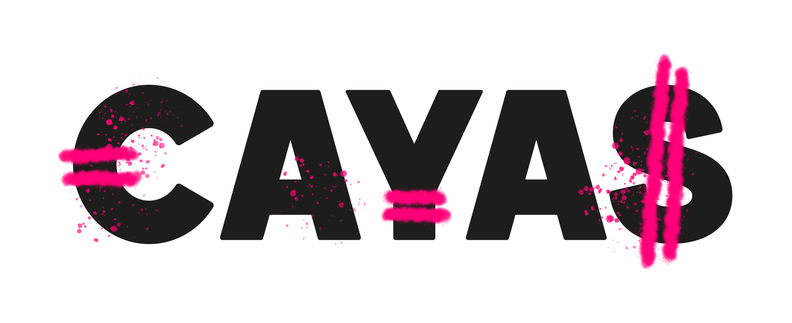

Ce dépôt compare la fiscalité du CTO (Compte Titres) et de l’AV (Assurance Vie) via plusieurs scénarios. Il met à disposition un simulateur et une interface disponible dans votre navigateur. Le code Python permet de reproduire les images du post original.

Note : ces figures diffèrent actuellement légèrement de celles du post, car j'ai ajouté les frais de notaire lors de la transmission d'un CTO - ce coût était initialement négligé. Je mettrai à jour le post dès que nous aurons bien compris ces frais de notaire et les conditions pour lesquelles ils s'appliquent. Pour l'heure, nous appliquons uniquement le barème forfaitaire. Il s'agit d'une approximation des frais réels.

## TODO : application en ligne

[app.cayas.fr](https://app.cayas.fr)

## Structure
- `api/` service FastAPI pour les tests de parité et scénarios
- `enveloppes/` logique de simulation (core/, envelopes/, succession/, analysis/)
- `simulations/` scripts qui génèrent les figures dans `images/`

## Installation
Créer un virtualenv et installer les dépendances :
```
make install-venv
make install-deps
source .venv/bin/activate
```

## Lancer l’API
```
make api
```
Port par défaut : 8001.

## Lancer les simulations
```
make simulations
```
Cela exécute tous les scripts de `simulations/`, génère les images dans `images/`.

## Notes / hypothèses
- Le rendement est modélisé en brut, avant frais d’enveloppe et fiscalité.
- Le CTO est en buy & hold par défaut ; la rotation applique la flat tax sur les plus-values réalisées.
- Les retraits AV après 8 ans appliquent l’abattement annuel et les sels d’IR réduits.
- La succession AV applique les prélèvements sociaux sur les gains au décès.


## Parcours pédagogique Cayas
[https://app.cayas.fr/lessons](https://app.cayas.fr/lessons)


## Simulateur plan de vie Cayas
[https://app.cayas.fr/tools/life-plan](https://app.cayas.fr/tools/life-plan)
