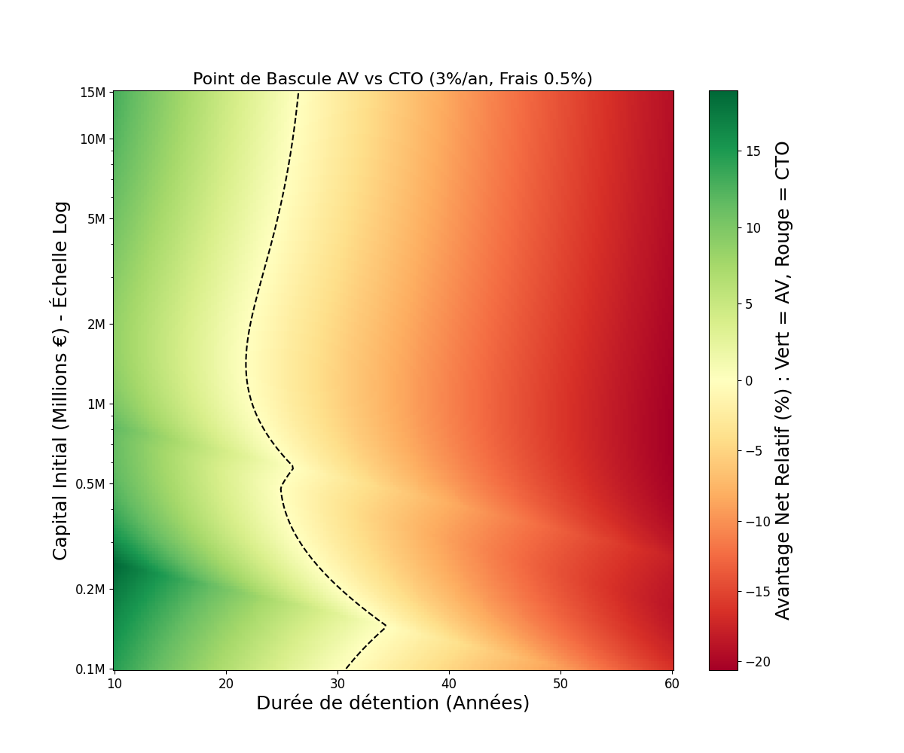
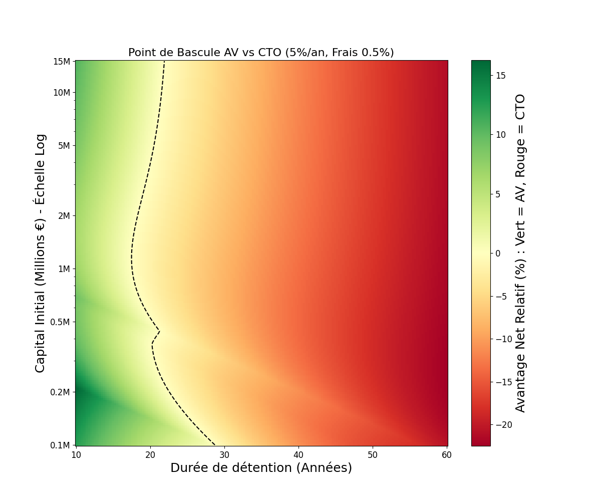
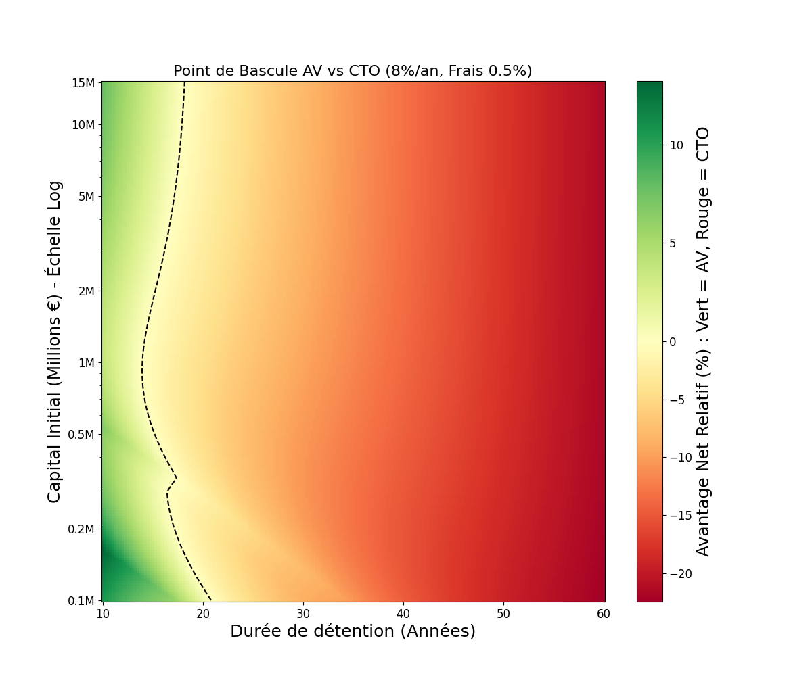
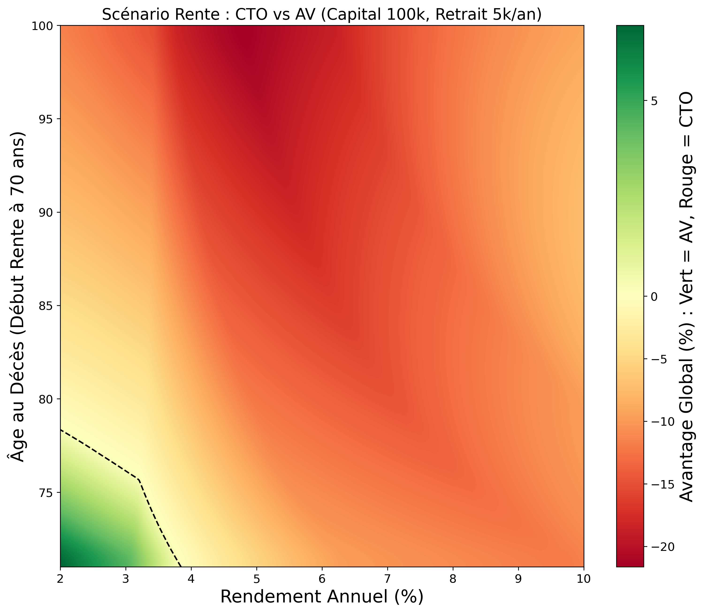
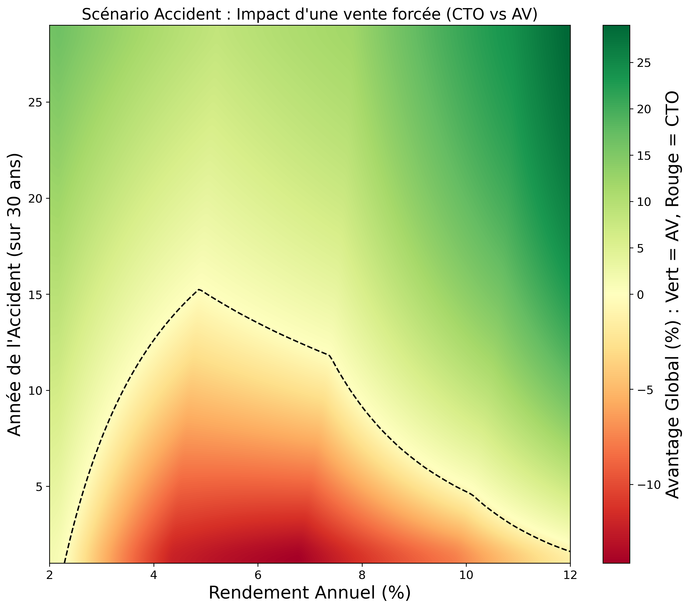
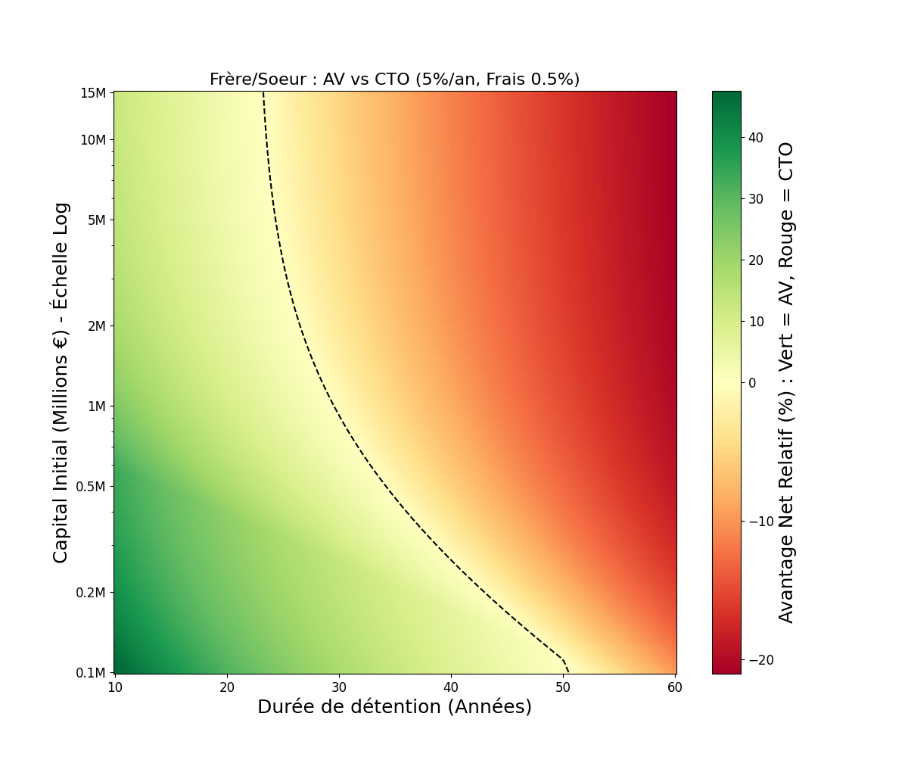

# CTO vs Assurance Vie : Guide de la transmission

> [!NOTE]
> Cette étude compare l'optimisation fiscale successorale entre le Compte Titres Ordinaire (CTO) et l'Assurance Vie ouverte avant 70 ans. Les hypothèses retiennent des frais de gestion de 0,5 % pour l'Assurance Vie, 0 % pour le CTO, et des Prélèvements Sociaux de 17,2 %.

## Mécanismes Fiscaux

La comparaison repose sur l'opposition entre l'absence de frais du Compte Titres et la fiscalité successorale de l'Assurance Vie. Le Compte Titres permet une composition du capital sans frottement et efface les plus-values au décès, mais subit une taxation successorale progressive pouvant atteindre 45 %. L'Assurance Vie impose des frais de gestion annuels qui réduisent le capital, en échange d'un abattement de 152 500 € et d'un taux d'imposition forfaitaire.

Prenons un exemple sur 20 ans avec 100 000 € de capital et 5 % de rendement annuel.
Sur un Compte Titres, le capital final atteint 265 330 €. La plus-value latente est effacée au décès et seuls les droits de succession s'appliquent sur la valeur de marché. L'héritier reçoit environ 215 000 €.
Sur une Assurance Vie, le capital final est réduit à 241 171 € par les frais de gestion. Au décès, les prélèvements sociaux réduisent l'assiette taxable. Après application de l'abattement et de la taxe, l'héritier perçoit 204 000 €.
Le Compte Titres est ici plus favorable car les frais de gestion cumulés sur deux décennies dépassent l'économie fiscale offerte par l'Assurance Vie.

---

## Analyse des Scénarios

Le cadre de l'étude est celui d'un investissement unique ("one-shot") réalisé aujourd'hui, dans une optique de transmission en ligne directe (parents vers enfants), sauf mention contraire.

Nous avons modélisé différents scénarios pour identifier le point de bascule entre les deux enveloppes fiscales. Les graphiques ci-dessous représentent en rouge les zones où le CTO est plus performant, et en vert celles favorables à l'Assurance Vie.

### Profil Prudent (3 %)

L'Assurance Vie est pertinente pour les profils obligataires ou sécurisés. Le faible rendement génère peu de plus-values, ce qui rend le mécanisme de purge du CTO moins impactant. L'abattement suffit alors à annuler toute imposition en Assurance Vie, compensant ainsi les frais de gestion si la détention ne dépasse pas 25 ans.

### Profil Équilibré (5 %)

L'avantage bascule selon le montant du patrimoine. Les capitaux inférieurs à 500 000 € profitent de l'abattement de l'Assurance Vie sur des durées courtes. Les patrimoines proches du million d'euros subissent en revanche une zone défavorable où le Compte Titres l'emporte, car l'abattement ne suffit plus à compenser le coût des frais. L'Assurance Vie ne redevient attractive qu'au-delà de 5 millions d'euros grâce au plafonnement du taux d'imposition.

### Profil Dynamique (8 %)

Le Compte Titres domine largement pour la classe moyenne supérieure. Un rendement élevé crée une plus-value latente massive qui est purgée sans impôt lors de la succession en Compte Titres, alors qu'elle est taxée en Assurance Vie. Cette dernière ne reste défendable que pour les très grands patrimoines dépassant 5 millions d'euros sur des horizons de 15 à 20 ans, où son taux plafonné à 31,25 % offre une protection contre la tranche marginale à 45 %.

### Cas Pratique : La Rente (Investir pour consommer)
Cette simulation porte sur 100 000 € investis à 50 ans avec retraits annuels de 5 000 € entre 70 et 80 ans.

Le résultat est nuancé selon la performance du placement et l'âge du décès. En zone verte (rendements inférieurs à 4,5 %), les gains sont modérés. L'abattement annuel de 4 600 € suffit alors à gommer presque totalement l'impôt sur le revenu. Dans ce cas précis, l'Assurance Vie l'emporte car l'avantage fiscal sur les retraits compense les frais de gestion, d'autant plus que l'espérance de vie est longue.

En zone rouge (rendements supérieurs à 5 %), la mécanique s'inverse et le Compte Titres devient plus performant. Le capital grossit fortement et les frais de gestion de 0,5 % s'appliquent chaque année sur une assiette de plus en plus large. Ce coût "invisible" finit par dépasser le montant de la Flat Tax (30 %) payée uniquement sur les gains lors des retraits.

### Cas Pratique : "L'Accident" (Fermeture d'ETF, Arbitrage forcé)
Ce scénario étudie l'impact d'une vente forcée intervenant en cours de vie du placement, par exemple suite à la fermeture d'un ETF.

L'Assurance Vie offre ici une protection majeure. En Compte Titres, la vente déclenche immédiatement l'imposition des plus-values (30 %). Cette ponction fiscale ampute le capital, qui cesse de produire des intérêts composés sur la somme versée à l'État. En Assurance Vie, l'arbitrage est fiscalement neutre tant que l'argent ne sort pas de l'enveloppe.

La carte thermique illustre cette supériorité quasi-totale de l'Assurance Vie. Plus le rendement est élevé et plus l'accident survient tardivement dans la vie de l'épargnant, plus le coût d'opportunité de l'impôt anticipé en Compte Titres est dévastateur.

### Transmission Frère et Soeur (5 %)

La transmission entre frères et sœurs constitue une exception notable du fait de la fiscalité punitive de droit commun (35 % puis 45 %). L'Assurance Vie offre un avantage mathématique quasi-systématique pour les capitaux modestes ou les durées raisonnables. Cependant, le Compte Titres finit par l'emporter à long terme sous l'effet des frais : le point de bascule se situe autour de 25 ans pour les patrimoines importants (plus d'un million d'euros) mais recule au-delà de 50 ans pour les capitaux plus modestes (100 000 €).

## Conclusion

Le choix dépend principalement de l'horizon de temps et du montant à transmettre. Le Compte Titres sans frais est la solution par défaut la plus performante pour la majorité des épargnants sur le long terme. L'Assurance Vie est un outil d'optimisation spécifique pour les transmissions en ligne collatérale ou pour protéger les très grands patrimoines sur des durées intermédiaires. Dans tous les cas, une détention supérieure à 35 ans favorise presque toujours le Compte Titres.
